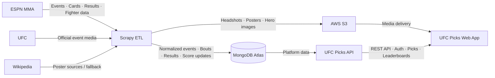

<div align="center">


# UFC Picks — Data Pipeline

### Automated UFC event ingestion, enrichment, and result synchronization.

Scrapy-based ETL service that keeps UFC Picks updated with events, fight cards,
results, fighter profiles, and media.

<br>

[](https://www.python.org/)
[](https://scrapy.org/)
[](https://www.mongodb.com/)
[](https://aws.amazon.com/s3/)

<sub>ESPN ingestion · Result synchronization · Fighter media · Scheduled automation</sub>

</div>

## What it does

The pipeline synchronizes the external sports data that powers UFC Picks:

- Upcoming and historical UFC events and complete fight cards.
- Fighter records, physical statistics, and ESPN source mappings.
- Officially available fight results and recalculated prediction scores.
- Fighter headshots, event posters, and wide hero images.

## Data flow



## Pipeline modes

| Mode | Purpose |
| --- | --- |
| `general` | Sync cards, fighters, records, available results, scores, and missing headshots. |
| `results` | Find unresolved bouts, import results, and recalculate scores. |
| `photos` | Mirror upcoming-card ESPN headshots into S3. |
| `event_images` | Resolve posters and wide event hero images. |

<details>
<summary>Commands</summary>

```bash
# General sync for recent and upcoming cards
scrapy crawl espn -a MODE=general -a DAYS_BACK=14 -a DAYS_AHEAD=60

# A season, a specific event, or only unresolved results
scrapy crawl espn -a MODE=general -a SEASON=2026
scrapy crawl espn -a MODE=general -a EVENT_ID=600059339
scrapy crawl espn -a MODE=results

# Media
scrapy crawl espn -a MODE=photos -a DAYS_AHEAD=60
scrapy crawl event_images
```

Use `-a FORCE_PHOTOS=true` to replace already-mirrored ESPN headshots.

</details>

## Data sources

ESPN's UFC JSON feeds are the primary source for cards, results, fighter
statistics, and headshots. The pipeline resolves posters through Wikipedia's
credited original sources (with a Wikipedia-file fallback) and wide hero images
from official UFC event pages.

## Source-ID strategy

Existing UFC Picks event and bout IDs remain canonical. The ETL matches ESPN
cards by source ID or by date, name, and fighter matchup, then stores ESPN
source IDs alongside the local records. This protects existing picks and web
URLs from ID changes. New ESPN-only cards use ESPN's numeric event and
competition IDs as their canonical IDs.

## Getting started

```bash
git clone https://github.com/JoseZum/ufc-picks-scraper.git
cd ufc-picks-scraper
python -m venv .venv
# Windows PowerShell: .venv\Scripts\Activate.ps1
# macOS/Linux: source .venv/bin/activate
pip install -r requirements.txt
```

Set `MONGODB_URI` for every ESPN mode. Media uploads also require
`AWS_ACCESS_KEY_ID`, `AWS_SECRET_ACCESS_KEY`, `AWS_S3_BUCKET`, `AWS_REGION`,
and `IMAGE_SOURCE_MODE=s3`.

## Automation

GitHub Actions runs:

- ESPN result synchronization every two hours.
- General ESPN ingestion on Monday and Thursday.
- Event posters and hero images daily.
- Upcoming-card headshots daily.

Every job can also be triggered manually from the workflow dispatch menu.

## Testing

```bash
pytest
```

## UFC Picks ecosystem

- [Platform overview](https://github.com/JoseZum/ufc-picks)
- [Web App](https://github.com/JoseZum/ufc-picks-frontend)
- [API](https://github.com/JoseZum/ufc-picks-backend)
- [Data Pipeline](https://github.com/JoseZum/ufc-picks-scraper)

<div align="center">

`ingest → predict → score → rank`

</div>
