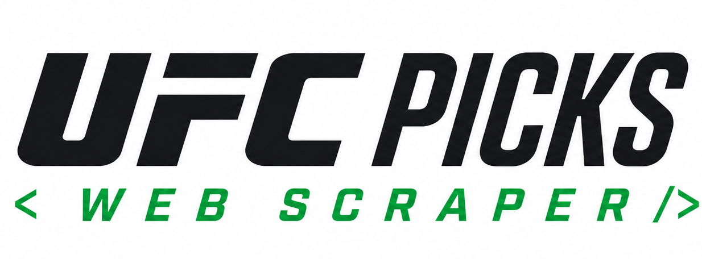
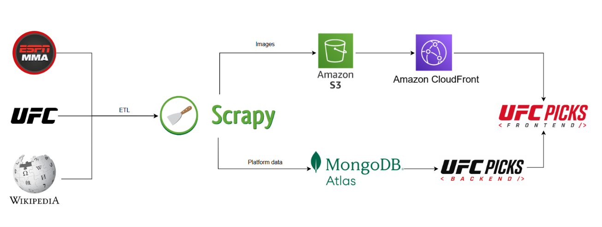

<div align="center">



# 

### Automated UFC event ingestion, enrichment, and result synchronization.

Scrapy-based ETL service that keeps UFC Picks updated with events, fight cards,
results, fighter profiles, and media.

<br>

[](https://www.python.org/)
[](https://scrapy.org/)
[](https://www.mongodb.com/)
[](https://aws.amazon.com/s3/)

<sub>ESPN ingestion · Result synchronization · Fighter media · Scheduled automation</sub>

</div>

## What it does

The pipeline synchronizes the external sports data that powers UFC Picks:

- Upcoming and historical UFC events and complete fight cards.
- Fighter records, physical statistics, and ESPN source mappings.
- Officially available fight results and recalculated prediction scores.
- Fighter headshots, event posters, and wide hero images.

## Data flow

<div align="center">



</div>

## Pipeline modes

| Mode | Purpose |
| --- | --- |
| `general` | Sync cards, fighters, records, available results, scores, and missing headshots. |
| `results` | Find unresolved bouts, import results, and recalculate scores. |
| `photos` | Mirror upcoming-card ESPN headshots into S3. |
| `event_images` | Resolve posters and wide event hero images. |

<details>
<summary>Commands</summary>

```bash
# General sync for recent and upcoming cards
scrapy crawl espn -a MODE=general -a DAYS_BACK=14 -a DAYS_AHEAD=60

# A season, a specific event, or only unresolved results
scrapy crawl espn -a MODE=general -a SEASON=2026
scrapy crawl espn -a MODE=general -a EVENT_ID=600059339
scrapy crawl espn -a MODE=results

# Media
scrapy crawl espn -a MODE=photos -a DAYS_AHEAD=60
scrapy crawl event_images
```

Use `-a FORCE_PHOTOS=true` to replace already-mirrored ESPN headshots.

</details>

### Retired one-time migrations

The 2026 historical-completion and scheduled-timing backfills have both run and
recorded their Mongo completion markers, so their `workflow_dispatch` options
were removed and the scripts moved to [`legacy/`](legacy/README.md) alongside
the other retired one-off repairs. Scheduled scraper windows are unaffected.

## Data sources

ESPN's UFC JSON feeds are the primary source for cards, results, fighter
statistics, and headshots. The pipeline resolves posters through Wikipedia's
credited original sources (with a Wikipedia-file fallback) and wide hero images
from official UFC event pages.

## Source-ID strategy

Existing UFC Picks event and bout IDs remain canonical. The ETL matches ESPN
cards by source ID or by date, name, and fighter matchup, then stores ESPN
source IDs alongside the local records. This protects existing picks and web
URLs from ID changes. New ESPN-only cards use ESPN's numeric event and
competition IDs as their canonical IDs.

## Getting started

```bash
git clone https://github.com/JoseZum/ufc-picks-scraper.git
cd ufc-picks-scraper
python -m venv .venv
# Windows PowerShell: .venv\Scripts\Activate.ps1
# macOS/Linux: source .venv/bin/activate
pip install -r requirements.txt
```

Set `MONGODB_URI` for every ESPN mode. Media uploads also require
`AWS_ACCESS_KEY_ID`, `AWS_SECRET_ACCESS_KEY`, `AWS_S3_BUCKET`, `AWS_REGION`,
and `IMAGE_SOURCE_MODE=s3`.

## Mission-readiness audit (read-only)

Audit one or more already-normalized `card-data/v1` snapshot files without
starting Scrapy or connecting to MongoDB:

```bash
# Deterministic JSON to stdout; contract validity is the default gate
python -m tapology_scraper.mission_readiness_audit snapshot.json

# Human-readable report and an explicit capability gate
python -m tapology_scraper.mission_readiness_audit snapshot.json \
  --format markdown \
  --require EVT,EVT_DATE,BOUT,ELIG,STRUCT

# Writing a report requires an explicit output path
python -m tapology_scraper.mission_readiness_audit snapshots/ \
  --format markdown \
  --output artifacts/mission-readiness.md
```

The input may be one snapshot object, an array, or `{ "snapshots": [...] }`.
Directories are read recursively for `.json` files; use `-` once for stdin.
The tool reports declared and effective readiness for `EVT`, `EVT_DATE`,
`BOUT`, `ELIG`, `STRUCT`, `TITLE`, and `RES`. It never reads environment
credentials, imports database/network clients, or modifies an input file.

| Exit code | Meaning |
|---:|---|
| `0` | Contract valid and every explicitly required capability is ready. |
| `1` | Audit completed with invalid snapshots, duplicates, or a required capability not ready. |
| `2` | CLI arguments, paths, JSON input, or explicit report output failed. |

## Golden production-card audit (strict read-only)

The Q-014/Q-018 audit is permanently allowlisted to event IDs `135755`,
`142341`, `136871`, and `142997`. The first remains the required negative
identity fixture; `142997` is the separately verified positive Fight Night
pair for ESPN `600059339`. The audit projects only the fields needed from
`events`, `bouts`, and `event_card_slots`; it never reads users/picks, retains
raw documents, or calls a Mongo write method.

Place the read-only credential in the ignored local `.env` file rather than a
shell argument or report:

```dotenv
MONGODB_URI=<read-only URI>
MONGODB_DB_NAME=ufc_picks
```

Then generate the sanitized review artifact explicitly:

```bash
python -m tapology_scraper.production_card_audit \
  --env-file .env \
  --format markdown \
  --output ../mission-planning/GOLDEN_PRODUCTION_CARD_AUDIT.md
```

The command returns `0` only when all observed facts satisfy the audit, `1`
when the report contains blocking findings, and `2` for safe configuration or
connection failure. Driver failures are redacted because their messages may
contain connection details.

## Writer/precedence inventory (local source only)

Validate that every candidate CardData mutation file in the scraper/backend
workspace is classified and that the SCR-007 evidence anchors still exist:

```bash
python -m tapology_scraper.writer_precedence_inventory \
  --workspace-root .. \
  --check
```

Regenerate the deterministic handoff report explicitly:

```bash
python -m tapology_scraper.writer_precedence_inventory \
  --workspace-root .. \
  --output ../mission-planning/WRITER_PRECEDENCE_DISCREPANCY_REPORT.md
```

This tool reads local source text only. It does not import application writers,
connect to MongoDB, use network access, or change writer behavior. A newly
detected mutation file or stale evidence anchor fails validation until the
inventory is reviewed.

## Canonical CardData normalizer (pure/in-memory)

`tapology_scraper.card_data_normalizer` is the SCR-008 boundary that future
source adapters and writers must share. It accepts sanitized, typed
observations for exactly one canonical event and an optional previous
`card-data/v1` snapshot:

```python
from tapology_scraper.card_data_normalizer import normalize_card_data_v1

result = normalize_card_data_v1(observations, previous_snapshot)

desired_snapshot = result.snapshot
semantic_changes = result.change_set
manual_review = result.quarantines
```

Every observation declares an ID, source kind, UTC observation time, canonical
event/entity IDs, non-secret source reference/source event ID, proposed values,
optional explicit clears and its identity basis. Admin/inference observations
also require a reason. Input order does not affect the result.

The normalizer resolves field-level precedence, rejects unsafe identity reuse,
derives global/section slot order once, computes current eligibility and
fingerprints, and increments semantic revisions only when their family changes.
TITLE is Admin-only: external title facts are retained as suggestions, and both
Admin `true` and `false` are durable until another explicit Admin action.

The module does not allocate new canonical IDs, import current writers, connect
to MongoDB, or persist the desired snapshot. Replacement IDs must be supplied
explicitly; storage reconciliation begins in SCR-009.

## Canonical slot reconciliation (dry-run first)

`tapology_scraper.slot_reconciliation` converts one validated canonical
snapshot plus the currently persisted event-slot documents into a deterministic
plan:

```python
from tapology_scraper.slot_reconciliation import plan_slot_reconciliation

plan = plan_slot_reconciliation(desired_snapshot, current_slot_documents)

print(plan.plan_id, plan.summary(), plan.safe_to_apply)
```

The plan contains only `insert` and `update` operations; already converged
slots are reported as unchanged. It never deletes a slot. A persisted slot
missing from the desired snapshot is a blocking conflict until SCR-010 decides
its cancellation/replacement lifecycle.

Application remains dry-run by default. A real local adapter must receive the
exact reviewed `plan_id` and implement one event-scoped atomic compare-and-set
through `SlotReconciliationStore.commit_slot_plan`. The helper then verifies
the receipt and final collection digest. The module itself does not import a
MongoDB client, open a connection, call current writers, or write production
data. Legacy bout placement fields are available only as a read-model
projection through `legacy_bout_slot_projection`; they are not dual-written.

## Late card-change policy (pure/in-memory)

`tapology_scraper.card_change_policy` wraps the normalizer with the SCR-010
lifecycle and disappearance rules:

```python
from tapology_scraper.card_change_policy import apply_card_change_policy

result = apply_card_change_policy(
    observations,
    previous_snapshot,
    coverage=complete_card_coverage,
    previous_presence_states=presence_states,
)

desired_snapshot = result.snapshot
reviewable_changes = result.policy_change_set
next_presence_states = result.presence_states
operational_findings = result.findings
```

Explicit cancellation, postponement and linked replacement facts apply
immediately. Missing bouts do not: automatic pre-lock removal requires three
distinct complete ESPN-detail observations spanning at least 30 minutes inside
the seven days before the card lock. Partial/non-authoritative/stale/post-lock
coverage retains canonical state. Coverage must match the canonical ESPN event
alias, replays cannot increment counters, Admin precedence remains intact, and
terminal bout/slot identities cannot silently revive.

The policy change set exposes current eligibility additions/removals and
consumer instructions while declaring frozen mission, streak and monthly
snapshots immutable. Like the normalizer and reconciler, this module has no DB,
network or current-writer dependency and performs no persistence.

## CardData backfill reconciliation report (strict no-write)

SCR-011/SCR-012A project the four Q-014/Q-018 production cards through the canonical
normalizer and slot reconciler without applying any operation:

```bash
python -m tapology_scraper.backfill_reconciliation_report \
  --env-file .env \
  --admin-title-attestation ../mission-planning/SCR-012_ADMIN_TITLE_ATTESTATION.json \
  --event-id 136871 \
  --event-id 142341 \
  --event-id 142997 \
  --format markdown \
  --output ../mission-planning/SCR-012_CANDIDATE_BACKFILL_DRY_RUN.md
```

The command is permanently allowlisted to event IDs `135755`, `142341`,
`136871`, and `142997`. It performs projected majority reads only, computes deterministic
snapshot/plan IDs and reports proposed operation counts, changed field names,
capability blockers and invariant failures. The artifact excludes raw
documents, before/after values, credentials and fighter names.
The optional Admin TITLE artifact is validated as a complete baseline for its
selected event scope and is hard-restricted to
`CARD_DATA_BACKFILL_DRY_RUN_ONLY`; `production_write_authorized` must be false.
It cannot authorize or execute MongoDB mutations.

Exit code `0` means every selected card is reviewable; `1` means the dry-run
completed but at least one card is blocked; `2` is a sanitized configuration or
connection failure. None of these states authorizes a write. A future backfill
requires a separately approved task, exact regenerated plan IDs, scoped
recoverable preimages, optimistic/atomic application and post-write invariant
verification.

## Guarded production backfill package (no-write CLI)

SCR-012B prepares the exact three-event execution package and encrypted
recoverable preimages without exposing a production-write command:

```bash
python -m tapology_scraper.production_backfill_package \
  --env-file .env \
  --admin-title-attestation ../mission-planning/SCR-012_ADMIN_TITLE_ATTESTATION.json \
  --preimage-key-file <absolute-private-path>/preimage-key.fernet \
  --create-key-file \
  --preimage-output <absolute-private-path>/preimages.bin \
  --manifest-output ../mission-planning/SCR-012B_FINAL_BACKFILL_PACKAGE.md
```

The key and encrypted archive must live outside the entire UFC Picks workspace
and are created exclusively; existing files are never overwritten. The
sanitized manifest contains only hashes, IDs and counts. The CLI has no
`--execute` switch and performs projected majority reads only.

The concrete `MongoCardDataBackfillAdapter` is separately callable code for
SCR-013. It is dry-run by default and requires a validated authorization naming
the exact content-derived run ID, all three events and all three slot plan IDs.
It preflights the full scope before its first mutation, uses one transaction,
performs no deletes and verifies both post-commit state and immediate replay.
Canonical event/bout data is stored under a `card_data_v1` compatibility
sidecar so existing top-level `fighters`, `result` and public API shapes remain
unchanged; canonical slots continue in `event_card_slots`.

## Automation

GitHub Actions runs:

- ESPN result synchronization every two hours.
- General ESPN ingestion on Monday and Thursday.
- Event posters and hero images daily.
- Upcoming-card headshots daily.

Every job can also be triggered manually from the workflow dispatch menu.

## Testing

```bash
pytest
```

## UFC Picks ecosystem

- [Platform overview](https://github.com/JoseZum/ufc-picks)
- [Web App](https://github.com/JoseZum/ufc-picks-frontend)
- [API](https://github.com/JoseZum/ufc-picks-backend)
- [Data Pipeline](https://github.com/JoseZum/ufc-picks-scraper)

<div align="center">

`ingest → predict → score → rank`

</div>
